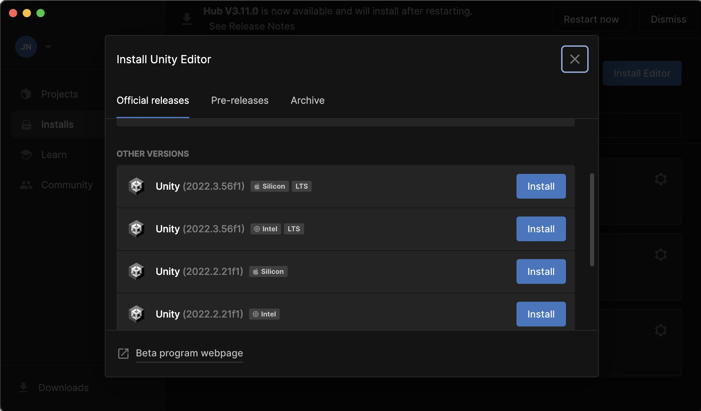
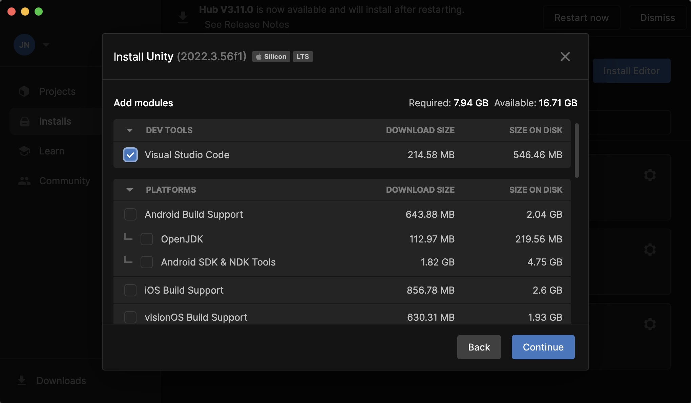

# Install Unity 
## Install Unity Hub
Go to [Download Unity Hub](https://unity.com/de/download) and download the Unity Hub, you will find the Download Link for Mac when you scroll down a bit. 

## Install Unity Editor 
After installing the Unity Hub, start it and head over to "Installs" and click on "Install Editor" and choose version 2022.3.14. If you have an Apple Silicon Chip (M1, M2, etc. ) choose the "Silicon" Version, if not the "Intel" version. 

Please also install the following packages: 
	- Android Build Support 
	- iOS Build Support 

 

