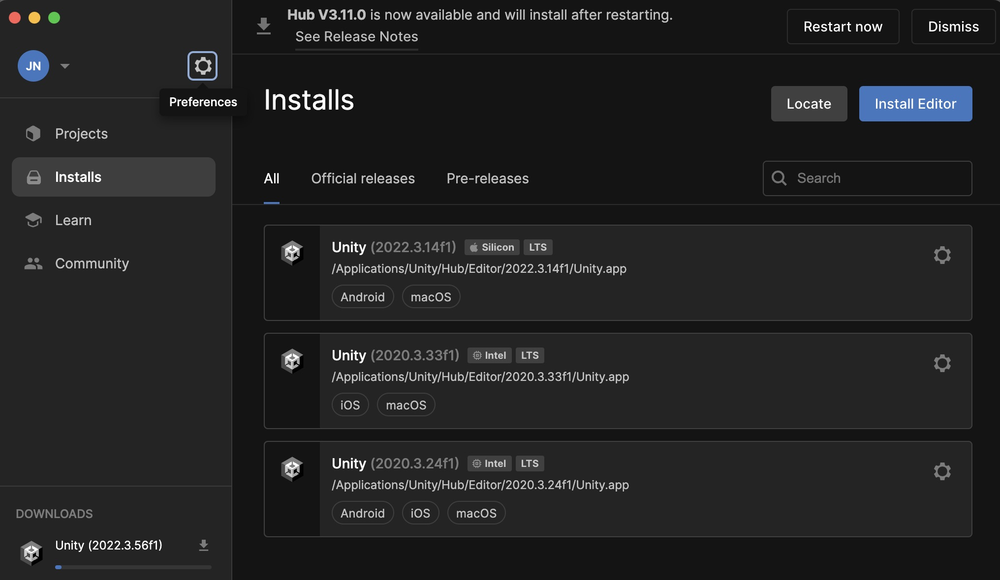
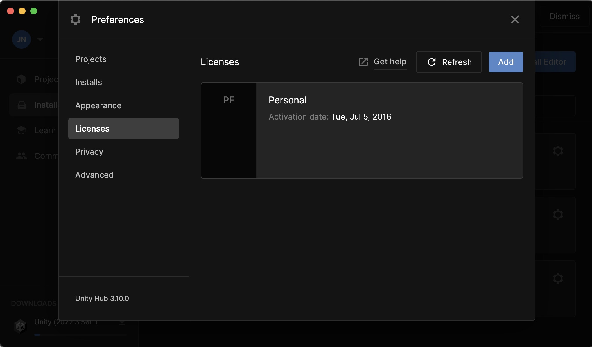
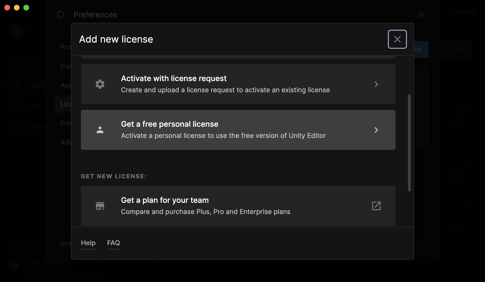
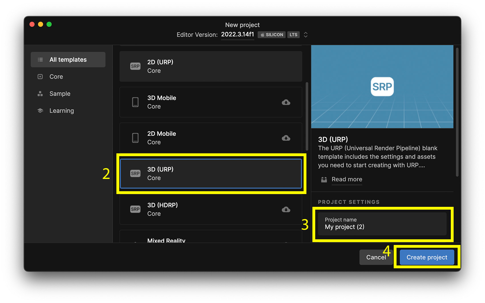

# Install Unity 
## Install Unity Hub
Go to [Download Unity Hub](https://unity.com/de/download) and download the Unity Hub, you will find the Download Link for Mac when you scroll down a bit. 

## Install Unity Editor 
After installing the Unity Hub, start it and head over to "Installs" and click on "Install Editor" and choose version 2022.3.56. If you have an Apple Silicon Chip (M1, M2, etc. ) choose the "Silicon" Version, if not the "Intel" version. 

Please also install the following packages: 
	- Visual Studio Code

## Activate License

Next get the free personal license: 

Go to preferences: 

-> Licenses -> Add 

-> Click on "Get a free personal license"

Sign up for a Unity Account and acivate the license. 
 
# Create your first project

Go to the Unity Hub and click on "New project" and choose 2022.3.56 (different than in the screenshot)

Then select "3D URP", choose a name for your project and click on "Create project"

