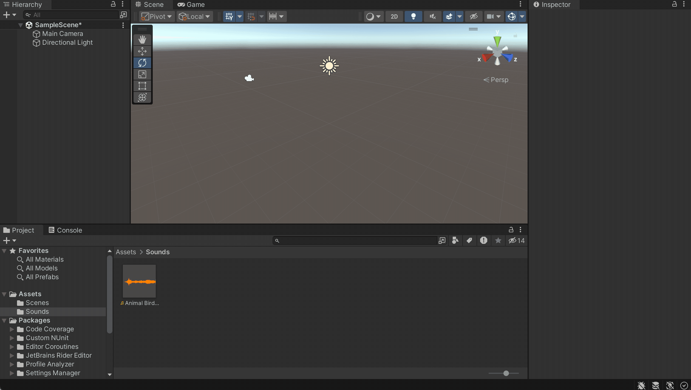

# Audio 

To add sound to a scene create a new Audio Source: GameObject -> Audio -> Audio Source. Or drag and drop your soundfile in the Sceneview. 

- [Tutorial: Sound Component in Unity](https://learn.unity.com/tutorial/working-with-audio-components-2019-3)

Supported file formats: 
- AIFF 
- WAV 
- MP3
- Ogg 

Places to get (free) sounds: 
- [Adobe Creative Cloud](https://www.adobe.com/products/audition/offers/AdobeAuditionDLCSFX.html)
- [Unity Asset Store](https://assetstore.unity.com/?category=audio&free=true&orderBy=1)
- [freesounds.org](https://freesound.org/people/Nox_Sound/)
- [OpenGameArt](https://opengameart.org/art-search-advanced?field_art_type_tid%5B%5D=13)
- [Soundcloud](https://soundcloud.com/)

> Tutorial how to work with Audio Tracks in the timeline: [Unity Learn: Audio and the Timeline](https://learn.unity.com/tutorial/working-with-audio-tracks-in-timeline#5f6126e3edbc2a0020034db9)

