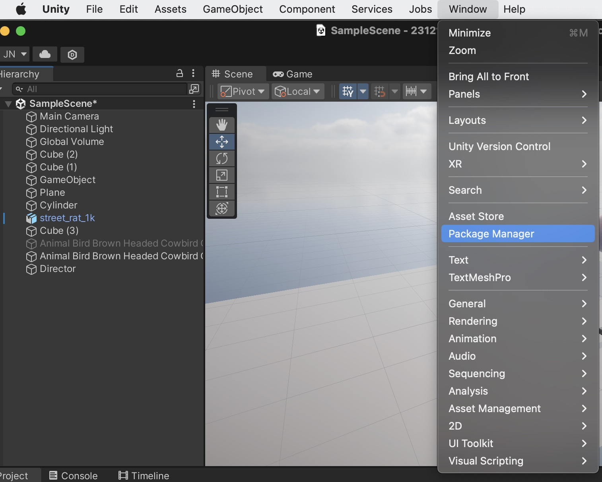
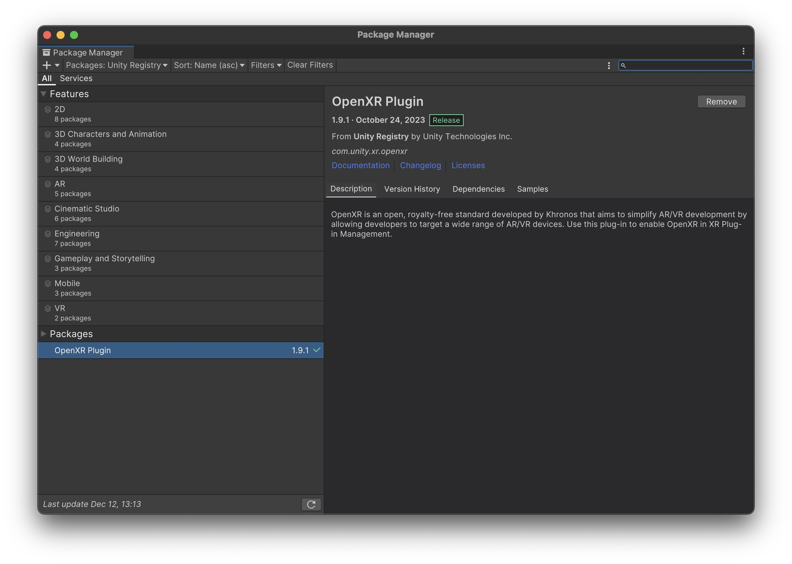
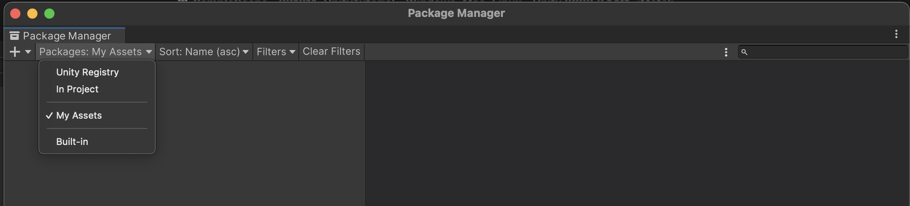
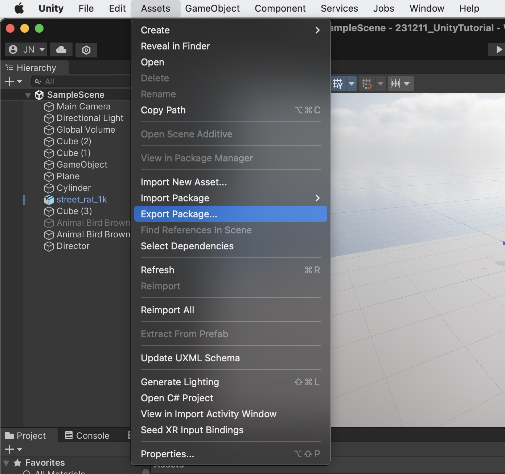
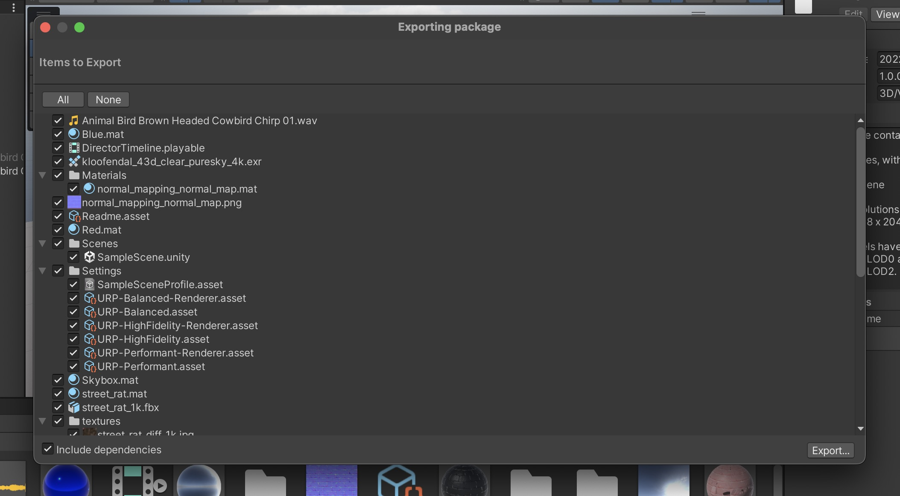
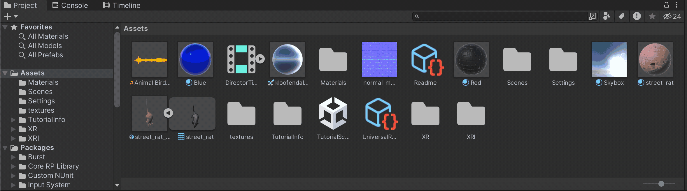
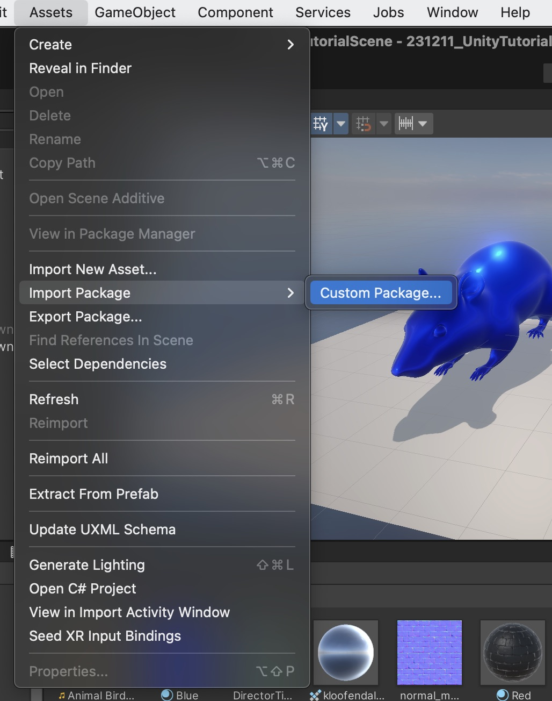

# Session 2 - Quick overview AR, structuring projects, packages, VR 

#  Quick Overview AR 

You can find more information on working with AR here: 
- [AR Foundation Demo Scenes](https://github.com/juliannetzer/arfoundation-demos_khb_sose22)
- [Tutorials on AR in Unity](https://www.youtube.com/watch?v=FWyTf3USDCQ)

How to build for iOS: 
[Build for iOS](https://github.com/juliannetzer/arfoundation-demos_khb_sose22/blob/master/build.md)

#  How to structure your unity projects
Since Unity projects quickly get very messy it is important to structure your assets & scenes, you can find some useful information here: 

[Best practices of organizing your unity project](https://unity.com/how-to/organizing-your-project)

# Packages

## Package Manager 

In the package manager you can find all sorts of packages (extionsion/add-ons) for Unity. There are some preconfigured packages from Unity, but you can also find your purchased items from the Asset Store there. 

To open the Package Manager go to: Window -> Package Manager

This will open the following window in which you can already see the preconfigured packages from Unity. 

To find your packages from the Asset Store select "Packages: My Assets"

## Creating your own package 

You can also create your own packages. This makes sense, for example, if you want to merge your project with another project. To create your own package go to Assets -> Export Package 

Then you can select the Assets that you want to include.

If you now click on Export it will export your files as .unitypackage-file. 

If you want to include Assets from only one scene you can first select your scene in the Project window, right click on it and click on "Select dependencies": 

When you now click on Assets -> "Export Package" Unity will only include the Assets from the scene that you selected. 

## Importing costum packages
To import a package (like the one you created earlier) click on Assets -> Import Package -> Costum Package

