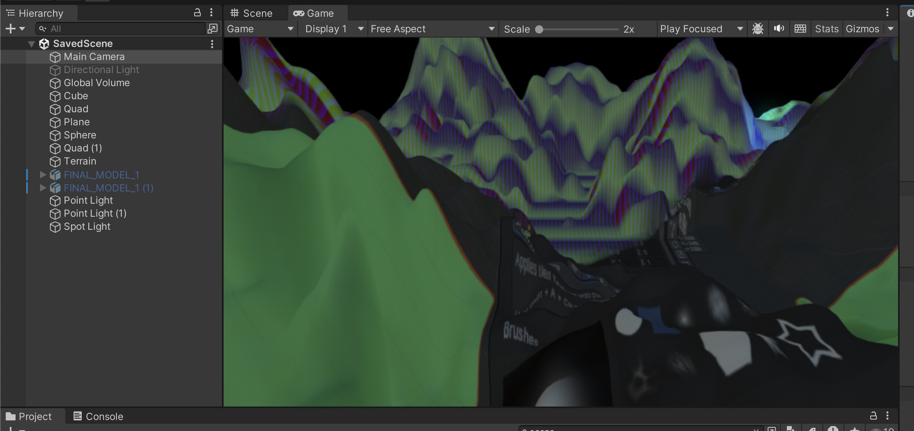
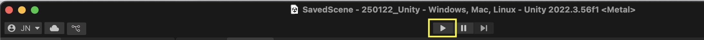
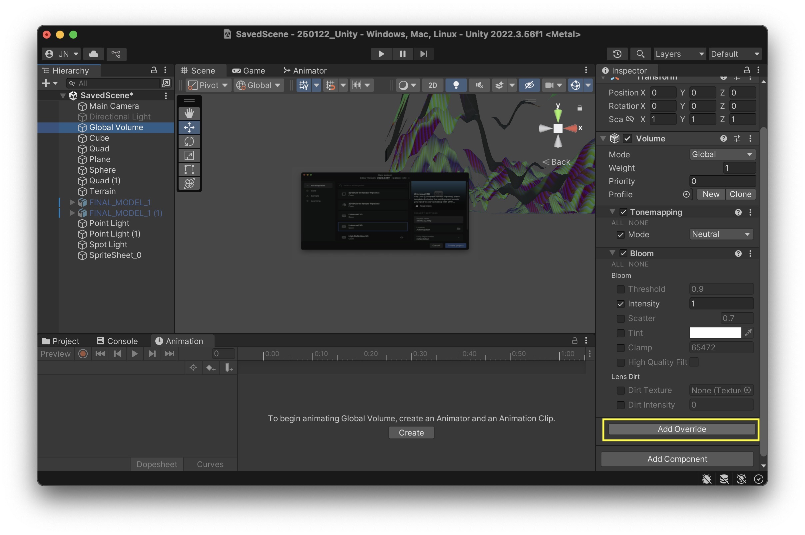

# Camera & The Game Windows

## Camera

The Camera in Unity acts as the player’s view into the game world, rendering everything it sees. It defines what is visible on screen, including perspective, depth, and field of view. Every Unity scene starts with a Main Camera, which you can find in the Hierarchy panel. You can adjust its properties in the Inspector, such as position, projection type (perspective or orthographic). In the scene view you can also see the cameras view frustum and a small preview of what the camera sees. 
When you are in the scene view you can right click on the camera and choose "Align to View", this aligns the camera to your current scene view.

## Game View
The Game View window in Unity shows how your game will look when played. It renders what the Main Camera sees and simulates the final player experience. You can test gameplay, adjust resolutions, and switch between different aspect ratios. The Play, Pause, and Step buttons allow you to run and debug your game in real time. Unlike the Scene View, which is for editing, the Game View provides a preview of the final visuals and interactions. 

When we work with Animations and Audio you can only see and hear the effect with the game running, to do this, click the Play-Button on top of the window: 

> !!! Changes made in Play Mode are not saved, so be sure to stop the game by clicking the Play button again before making any adjustments. !!! 

# Visual Effects & Global Volume

The Global Volume in Unity is a component that applies post-processing effects across the entire scene. You can adjust settings like exposure and color adjustments in a Volume Profile to control the overall look of your game. Since it affects the whole scene, it’s useful for setting up consistent visual aesthetics. 

To change the settings select "Global Volume" in your hiearchy, in the inspector you can see the different settings. If you click on "Add Override" you can add effects. 

> If you don't have a Global Volume Game Object in your scene you can add it when you go to: GameObject -> Volume -> Global Volume

Some of the effects are: 
- Chromatic Aberration – Simulates lens distortion by slightly separating colors, creating a fringing effect often seen in real-world camera lenses.
- Color Adjustments – Allows control over brightness, contrast, saturation, and hue to fine-tune the overall color balance of the scene.
- Depth of Field – Blurs objects based on their distance from the camera, mimicking how real cameras focus on specific areas.
- Film Grain – Adds a subtle grainy texture to simulate the look of old film cameras, enhancing a cinematic feel.
- Lens Distortion – Warps the edges of the image to mimic real-life lens imperfections, often used to create a fisheye or wide-angle effect.
- Lift, Gamma, Gain – Provides fine control over color grading by adjusting shadows (lift), midtones (gamma), and highlights (gain).
- Motion Blur – Blurs objects based on their speed and direction, creating a smoother, more dynamic look for fast movements.
- Shadows, Midtones, Highlights – Separately adjusts the brightness and color of different tonal ranges, offering advanced control over lighting and contrast.

> You can find a detailled Tutorial here: [POST PROCESSING in URP (Universal Render Pipeline)](https://www.youtube.com/watch?v=oXNy9mszKxw)

# Audio 

To add sound to a scene create a new Audio Source: GameObject -> Audio -> Audio Source. Or drag and drop your soundfile in the Sceneview. 

Supported file formats: 
- AIFF 
- WAV 
- MP3
- Ogg 

Places to get (free) sounds: 
- [Adobe Creative Cloud](https://www.adobe.com/products/audition/offers/AdobeAuditionDLCSFX.html)
- [Unity Asset Store](https://assetstore.unity.com/?category=audio&free=true&orderBy=1)
- [freesounds.org](https://freesound.org/people/Nox_Sound/)
- [OpenGameArt](https://opengameart.org/art-search-advanced?field_art_type_tid%5B%5D=13)
- [Soundcloud](https://soundcloud.com/)

> - [Tutorial: Sound Component in Unity](https://learn.unity.com/tutorial/working-with-audio-components-2019-3)

## Spatial Audio

Spatial audio in Unity simulates how sounds change based on their position relative to the listener, creating a more immersive experience. It takes into account distance, direction, and environmental effects to make sounds feel like they are coming from specific locations in 3D space.

### Audio Listener & Audio Sources

- The Audio Listener component, usually attached to the Main Camera, represents the player's "ears" and determines how sound is perceived in the scene. Only one Audio Listener should be active at a time.
- Audio Sources are attached to GameObjects that produce sound. They determine volume, pitch, spatial blend, and 3D positioning of the audio.

With "Min Distance" and "Max Distance" you can set the minimum and maximum distance of audibility. 

With the "Volume Rolloff" you can select different Rolloff algorithms. Select "Linear Rolloff" if you want to hear a strong difference based on the positioning, "Logarithmic Rolloff" for a more realistic effect. 

# Animation

## Animations window 

To animate an object, open the "Animation" window (Window -> Animation -> Anmation). 
Then select the GameObject you want to animate in the hierarchy window, now you should see this in the Animation Window: 

Click on "Create" this creates an *Animation Clip*.

Now you can start to animate your object either by hitting the record button:

or by manually adding the properties and keyframes: 

https://learn.unity.com/tutorial/introduction-to-sprite-animations#

See also:
- [Tutorial Animation in Unity](https://learn.unity.com/tutorial/working-with-animations-and-animation-curves#)

By default the Animation will loop, if you only want it to play once select the Animation Clip in the Project window and untick "Loop Time" in the Inspector. 

> This method works best when you want to animate a single objects, like a spinning light. If you want to animate multiple objects together and the timing is importing, like for example a cinematic scene, or a transition scene then the "Timeline"-feature works better. 

## Animator window

*Note: In the next session we will have a look how we can change animations in the animator window* 
The Animator selects which of your animation clips will be played. For example when you want to create a Character that has different states (like walking, standing, running) and one animation clip for each state you would animate this in the Animator window (in general: non-linear animations). 

## Timeline

The Timeline works best if you want to create a linear sequence of animations, like a transition scene or a little movie sequence. 

To work with the Timeline open the Timeline window (Window -> Sequencing -> Timeline). 
Then create an empty GameObject (GameObject -> Create Empty) and name it "Director", this GameObject will control our movie sequence (and also our cameras later). 

> You can click on the settings wheel on the upper right side and choose whether you wanna work in seconds or in frames. 

### Activating Objects in the Timeline
With the timeline you can easily activate and deactivate objects. Right-click on the left side of the Timeline window and select "Activation Track" then drag and drop the GameObject you want to activate and deactive in the selector field. 

You can also change the time when and for how long your object should be active

### Animate Objects
You can also animate object in the same way as in the Animation window, but in the Timeline window you can directly see the timing for the whole scene, in case the animation should happen at a specific point in time. 
Right click on the left side again and select "Animation Track" (always make sure that the "Director" GameObject is selected in the hierarchy) then drag and drop the object you want to animate in the selector field and click on record. 

> Here you can find some information about the other tracks you can use with the timeline: [Overview of the Timeline-Features](https://lukeduckett.medium.com/it-all-comes-down-to-timing-a-quick-guide-to-timeline-in-unity-fd96b26820f4),[Control Track](https://christopherhilton88.medium.com/what-is-a-control-track-in-timeline-f70588662cce), [Signal Track](https://blog.unity.com/technology/how-to-use-timeline-signals), [Playable Track](https://docs.unity3d.com/2018.3/Documentation/ScriptReference/Timeline.PlayableTrack.html)

> Tutorial how to work with Audio Tracks in the timeline: [Unity Learn: Audio and the Timeline](https://learn.unity.com/tutorial/working-with-audio-tracks-in-timeline#5f6126e3edbc2a0020034db9)
