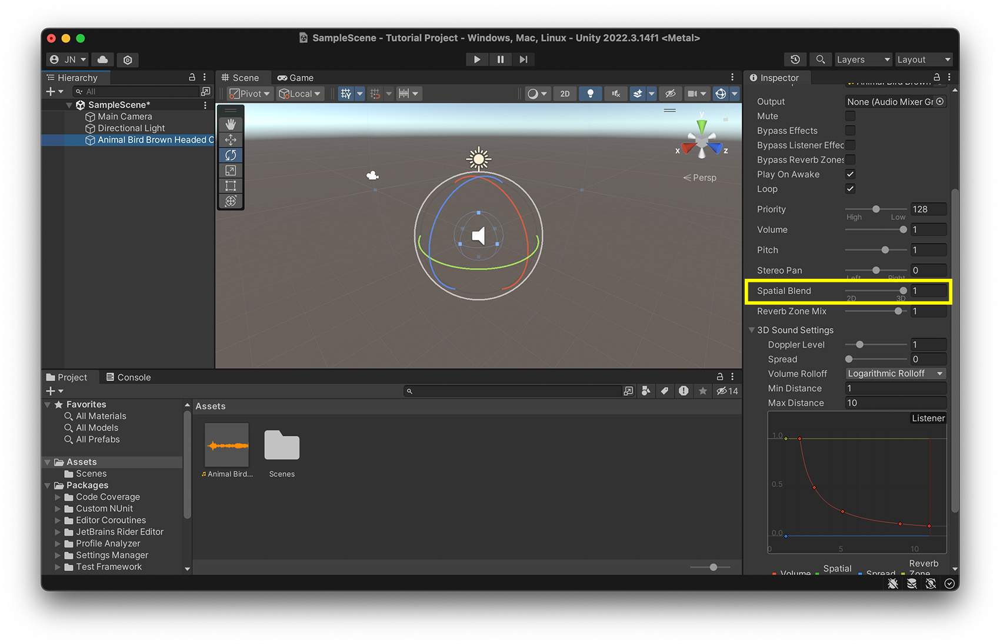
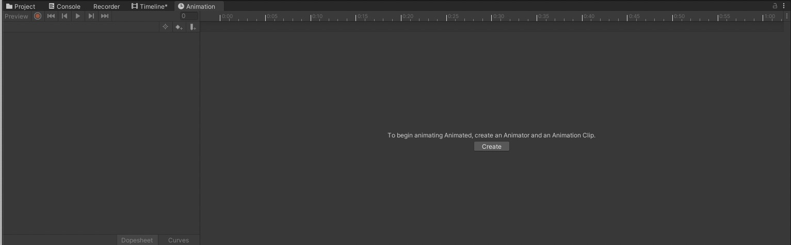
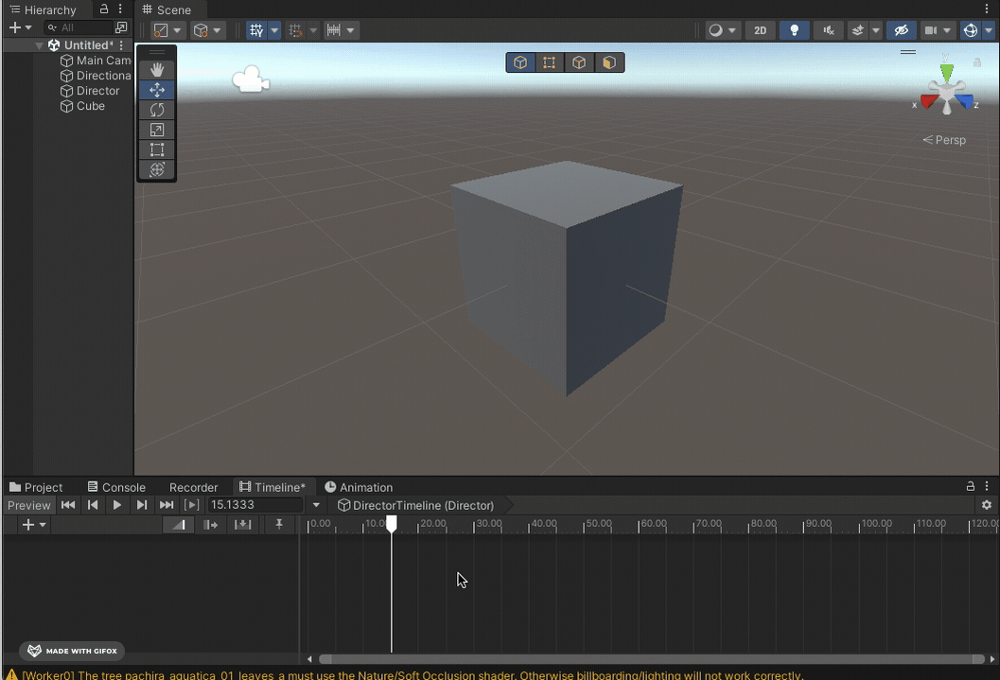

# Audio 

To add sound to a scene create a new Audio Source: GameObject -> Audio -> Audio Source. Or drag and drop your soundfile in the Sceneview. 

- [Tutorial: Sound Component in Unity](https://learn.unity.com/tutorial/working-with-audio-components-2019-3)

Supported file formats: 
- AIFF 
- WAV 
- MP3
- Ogg 

### Spatial Audio

Places to get (free) sounds: 
- [Adobe Creative Cloud](https://www.adobe.com/products/audition/offers/AdobeAuditionDLCSFX.html)
- [Unity Asset Store](https://assetstore.unity.com/?category=audio&free=true&orderBy=1)
- [freesounds.org](https://freesound.org/people/Nox_Sound/)
- [OpenGameArt](https://opengameart.org/art-search-advanced?field_art_type_tid%5B%5D=13)
- [Soundcloud](https://soundcloud.com/)

> Tutorial how to work with Audio Tracks in the timeline: [Unity Learn: Audio and the Timeline](https://learn.unity.com/tutorial/working-with-audio-tracks-in-timeline#5f6126e3edbc2a0020034db9)

## Spatial Audio

Spatial Audio works in Unity out of the box. If you have created an audio source in unity, you can use the "Spatial Blend" value to set how much the positioning of the audio source affects the volume and audible direction of the source. 

With "Min Distance" and "Max Distance" you can set the minimum and maximum distance of audibility. 

With the "Volume Rolloff" you can select different Rolloff algorithms. Select "Linear Rolloff" if you want to hear a strong difference based on the positioning, "Logarithmic Rolloff" for a more realistic effect. 

# Animation: Timeline

## Animations window 

To animate an object, open the "Animation" window (Window -> Animation -> Anmation). 
Then select the GameObject you want to animate in the hierarchy window, now you should see this in the Animation Window: 

Click on "Create" this creates an *Animation Clip*.

Now you can start to animate your object either by hitting the record button:

or by manually adding the properties and keyframes: 

See also:
- [Tutorial Animation in Unity](https://learn.unity.com/tutorial/working-with-animations-and-animation-curves#)

By default the Animation will loop, if you only want it to play once select the Animation Clip in the Project window and untick "Loop Time" in the Inspector. 

> This method works best when you want to animate a single objects, like a spinning light. If you want to animate multiple objects together and the timing is importing, like for example a cinematic scene, or a transition scene then the "Timeline"-feature works better. 

## Animator window

*Note: In the next session we will have a look how we can change animations in the animator window* 
The Animator selects which of your animation clips will be played. For example when you want to create a Character that has different states (like walking, standing, running) and one animation clip for each state you would animate this in the Animator window (in general: non-linear animations). 

## Timeline

The Timeline works best if you want to create a linear sequence of animations, like a transition scene or a little movie sequence. 

To work with the Timeline open the Timeline window (Window -> Sequencing -> Timeline). 
Then create an empty GameObject (GameObject -> Create Empty) and name it "Director", this GameObject will control our movie sequence (and also our cameras later). 

> You can click on the settings wheel on the upper right side and choose whether you wanna work in seconds or in frames. 

### Activating Objects in the Timeline
With the timeline you can easily activate and deactivate objects. Right-click on the left side of the Timeline window and select "Activation Track" then drag and drop the GameObject you want to activate and deactive in the selector field. 

You can also change the time when and for how long your object should be active

### Animate Objects
You can also animate object in the same way as in the Animation window, but in the Timeline window you can directly see the timing for the whole scene, in case the animation should happen at a specific point in time. 
Right click on the left side again and select "Animation Track" (always make sure that the "Director" GameObject is selected in the hierarchy) then drag and drop the object you want to animate in the selector field and click on record. 

> Here you can find some information about the other tracks you can use with the timeline: [Overview of the Timeline-Features](https://lukeduckett.medium.com/it-all-comes-down-to-timing-a-quick-guide-to-timeline-in-unity-fd96b26820f4),[Control Track](https://christopherhilton88.medium.com/what-is-a-control-track-in-timeline-f70588662cce), [Signal Track](https://blog.unity.com/technology/how-to-use-timeline-signals), [Playable Track](https://docs.unity3d.com/2018.3/Documentation/ScriptReference/Timeline.PlayableTrack.html)
