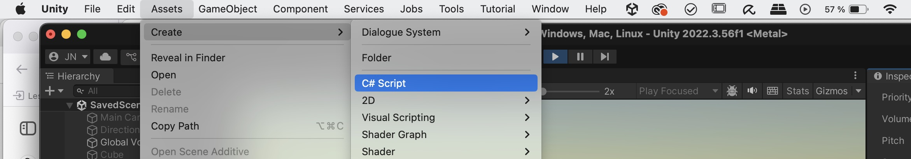
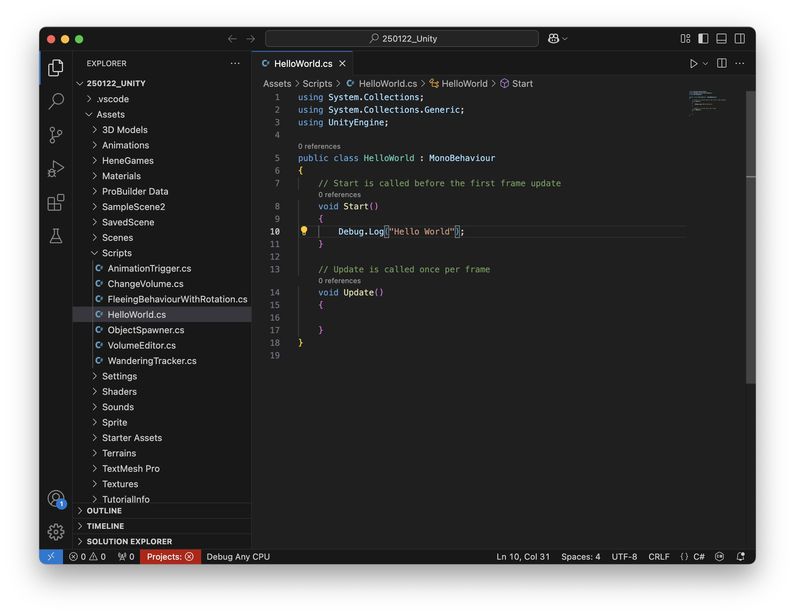

# Coding in Unity 

In Unity, scripts with the programming language C# are used to control the behavior of GameObjects. Scripts interact with objects by modifying their properties, responding to player input, or handling game logic. Each script is typically attached to a GameObject as a component, allowing it to influence that object.

A script is a asset saved as a .cs-File 

A basic Unity script looks like this:
```
using UnityEngine; //import classes needed for the script to run, in this case the basic Unity Engine

public class ExampleScript : MonoBehaviour //Name of the Script (must be the same as the filename)
{
    void Start()
    {
        // Runs once when the GameObject is first activated
    }

    void Update()
    {
        // Runs every frame, useful for movement or checking inputs
    }
}
```
## Function/Method

A function (also called a method) in Unity is a block of code that performs a specific task. Functions help organize code, making it reusable and easier to manage. In Unity, functions are often used to control GameObjects, handle player input, or execute game logic.
Structure of a Function

A function in C# consists of:
- Return Type – Defines what the function returns (e.g., void for no return, int for numbers).
- Function Name – The identifier used to call the function.
- Parameters (Optional) – Data passed into the function.
- Code Block – The actual instructions inside { }.

```
void Start()
    {
        Debug.Log("Hello World");// Runs once when the GameObject is first activated, this writes "Hello World" in the console.
    }
```

## Variables

Variables are used to store and manage data in Unity scripts. They can hold different types of values, such as numbers, text, or references to objects.
Types of Variables

- int – Stores whole numbers (e.g., int score = 10;).
- float – Stores decimal numbers (e.g., float speed = 5.5f;).
- bool – Stores true or false (e.g., bool isJumping = false;).
- string – Stores text (e.g., string playerName = "Alex";).
- GameObject / Transform / Rigidbody – Stores references to Unity objects.

#### Public Variables & Unity Editor

Variables declared as public can be edited directly in the Inspector without modifying the script. This makes tweaking values easier without needing to recompile the code.
Example:

```
using UnityEngine;

public class ChangeVolume : MonoBehaviour
{
    public float Volume = 0.5f;  // Visible in Inspector

    void Update()
    {
        GetComponent<AudioSource>().volume = Volume;
    }
}
```

This script appears in the Editor like this and allows you to change the volume of the audio source while in Play Mode: 


## Examples how scripts interact with GameObjects

#### Access Components – Scripts can modify an object's Transform, Audio Source, Rigidbody, Collider, or any other component.
```
GetComponent<AudioSource>().volume = 0;
```

#### Modify Object Properties – Change position, scale, color, or any other attribute.
```
transform.position = new Vector3(0, 2, 0);
```
#### Handle Player Input – Detect key presses, mouse clicks, or controller inputs.
```
    if (Input.GetKeyDown(KeyCode.Space))
    {
        Debug.Log("Jump!");
    }
```

## Creating a new Script

To create a script select Assets -> Create -> C# Script and select a name (please use a name that describes the function in our case "ChangeVolume"). 


Then double click on the script in the project window, this should open Visual Studio Code with the script opened: 


Now we can copy & paste our code: 
```
using UnityEngine;

public class PlayAudioOnTrigger : MonoBehaviour
{
    public AudioSource audioSource;  // Assign in Inspector

    void OnTriggerEnter(Collider other)
    {
        if (!audioSource.isPlaying) // Play only if not already playing
        {
            audioSource.Play();
        }
    }
}
```

How to Use:

1. Attach (via Drag & drop) this script to a GameObject with a Collider (e.g., a trigger zone).
2. Enable "Is Trigger" in the Collider settings.
3. Assign an AudioSource in the Inspector (drag & drop).
4. When another Collider (with a Rigidbody) enters the trigger, the sound will play.


Then save the file (Cmd/Strg + S) and go back to Unity. 

Now you can drag and drop the script to a Audio Source in your Scene and it should look like this: 


